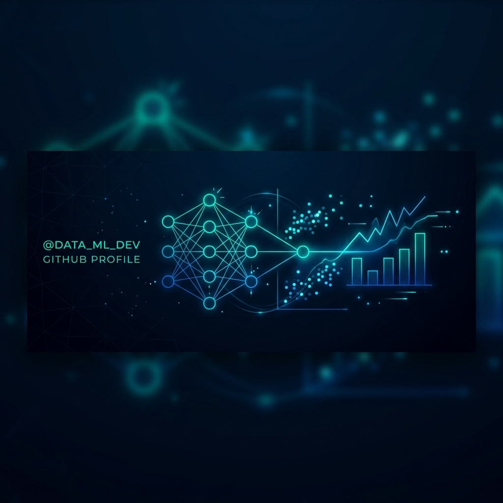

# Hi there, I'm BM Excel Blaze 👋

  

  <strong>Data Analyst | Business Analyst | MIS & Reporting Analyst</strong>

  
  
  

---

### 💫 About Me

I am a versatile and driven **Data and Business Analyst (B.Tech in AI & Data Science)** with practical experience turning raw, complex datasets into decision-ready business insights. I leverage SQL, Python, Power BI, Tableau, and Advanced Excel to build clean data models, uncover hidden trends, and design high-fidelity KPI dashboards.

* 🚀 **My Philosophy**: Data is only as good as the decisions it enables. I focus on data storytelling to bridge the gap between technical metrics and business strategy.
* 🛠️ **Vibe Coding**: I enjoy building web applications and rapid prototypes using modern AI-assisted development tools.
* 🎯 **Open to Opportunities**: I am actively looking for entry-level analyst roles—including **Data Analyst, Business Analyst, MIS / Reporting Analyst, BI Developer, Operations Analyst, or Product Analyst** (Hyderabad, India or Remote).

---

### 🛠️ Technical Toolbox

<table width="100%">
  <tr>
    <td width="50%" valign="top">
      <h4>💻 Languages & Databases</h4>
      
      
      
      
      
      
      
    </td>
    <td width="50%" valign="top">
      <h4>📊 BI & Spreadsheets</h4>
      
      
      
      
      
    </td>
  </tr>
  <tr>
    <td width="50%" valign="top">
      <h4>🧠 Machine Learning & AI</h4>
      
      
      
      
    </td>
    <td width="50%" valign="top">
      <h4>📈 Currently Learning</h4>
      
      
      
      
    </td>
  </tr>
</table>

---

### 💼 Professional Experience

**AI & Data Science Intern** | **InternCourse** *(Nov 2024 – May 2025)*
* 🧹 **Data Cleaning & Engineering**: Cleaned, transformed, and validated raw multi-source datasets using **Python (Pandas)** and **SQL**, saving ~30% in data preparation time and bolstering reporting accuracy.
* 🔍 **Database Management**: Wrote complex SQL queries (Joins, Aggregations, Subqueries) to extract and prepare analysis-ready datasets.
* 📈 **Exploratory Analysis**: Conducted deep EDA to identify key trends, seasonal variances, and anomalies to inform business strategy.
* 🤖 **Predictive Modeling**: Developed and evaluated classification and regression models, executing feature engineering and target class optimization.
* 🖼️ **Stakeholder Reporting**: Built clear visual reports with Matplotlib and Excel, communicating project milestones effectively to mentors.

---

### 🚀 Featured Projects

#### 📊 [Sales Analytics Dashboard](https://github.com/codingwithblaze) (SQL · Python · Power BI · Excel)
* Consolidated and standardized over 50,000 sales transactions using Python and SQL to remove duplicates and missing values.
* Modeled seasonal demand fluctuations and top-performing categories using relational database schemas.
* Built an interactive **Power BI Dashboard** leveraging **DAX measures** and KPI metrics to automate manual reporting, significantly increasing reporting efficiency.

#### 🐠 [Underwater Object Detection (YOLOv7-Tiny)](https://github.com/codingwithblaze) (Python · Computer Vision · Deep Learning)
* Configured a custom data pipeline including image preprocessing, augmentation, and normalization.
* Trained and optimized an improved YOLOv7-Tiny model, successfully lowering false positives and boosting accuracy for object tracking in marine environments.

#### 🎙️ [AI Voice Assistant](https://github.com/codingwithblaze) (Python · NLP · Speech Recognition)
* Created a lightweight voice control agent utilizing speech recognition APIs and NLP to parse user commands, query information, and automate tasks.

---

### 🎓 Education

* 🎓 **B.Tech in Artificial Intelligence & Data Science** (2021 – 2025)
  * *Sri Indu College of Engineering and Technology, Ibrahimpatnam* | **CGPA: 7.31**
* 🏫 **Intermediate (MPC)**
  * *Sri Chaitanya Junior College* | **85%**
* 📝 **SSC (10th Grade)**
  * *BSE Telangana* | **CGPA: 8.5**

---

### 📜 Certifications & Job Simulations

* 🏆 **AI & Data Science Professional Internship** (6 Months) — *InternCourse*
* ⚙️ **GenAI-Powered Data Analytics Job Simulation** — *Forage*
* 📊 **Complete Data Science Bootcamp 2025** — *Udemy*
* 🧠 **Machine Learning A-Z (AI, Python & R)** — *Udemy*
* 🐍 **100 Days of Code: Python Pro Bootcamp** — *Udemy*
* 💻 **Data Structures & Algorithms** — *ExcelR*
* 🎓 **Python Programming** — *Naresh Technologies*
* ☁️ **Microsoft AI Innovators Hub & AI Tools Workshop** — *be10x*

---

### 📊 GitHub Stats

  
  

  

---

  <i>Thanks for visiting my profile! Feel free to explore my repositories or reach out for collaboration.</i>

